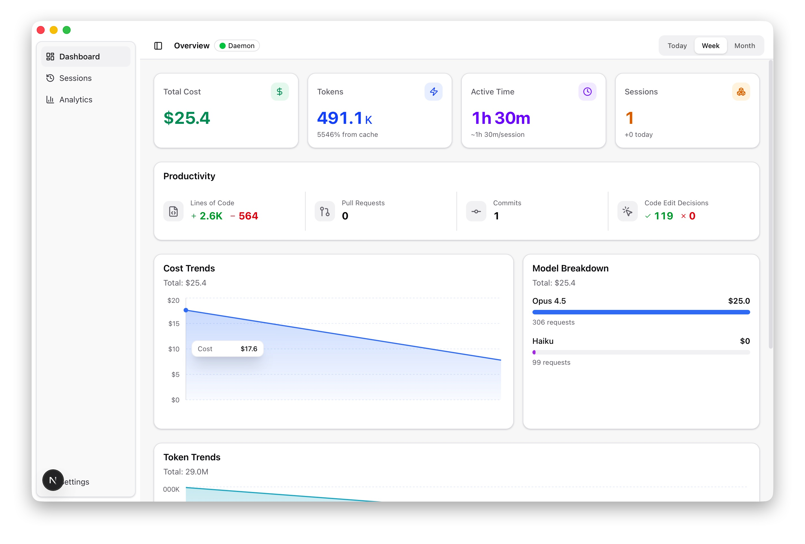
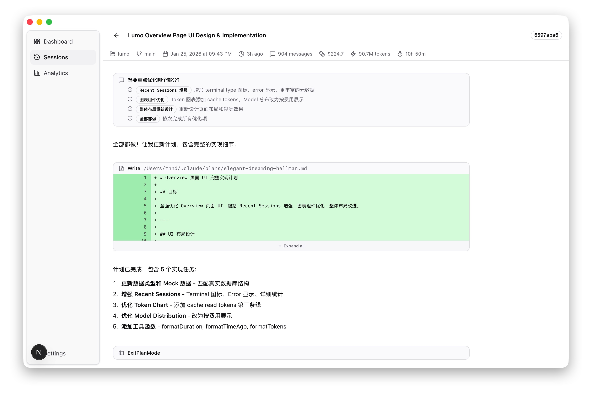
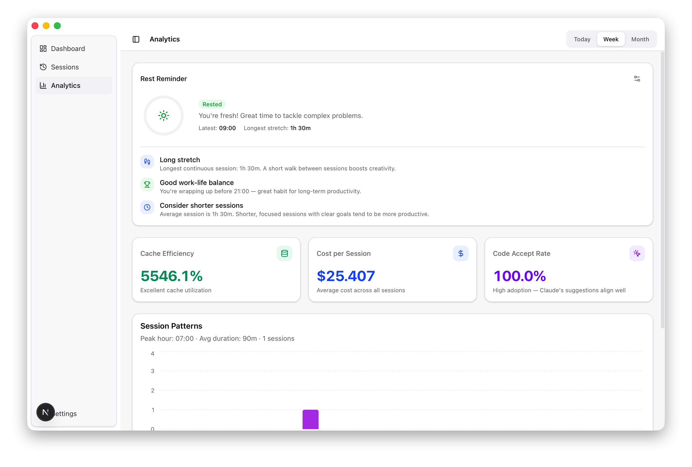

<p align="center">
  
</p>

<h1 align="center">Lumo</h1>

<p align="center">
  A local-first desktop dashboard for tracking Claude Code usage.<br/>
  Cost, tokens, sessions, and time — all from your own machine.
</p>

<p align="center">
  <a href="#why-lumo">Why</a> &bull;
  <a href="#features">Features</a> &bull;
  <a href="#how-it-works">How It Works</a> &bull;
  <a href="#getting-started">Getting Started</a> &bull;
  <a href="#tech-stack">Tech Stack</a>
</p>

---

## Why Lumo?

Claude Code provides powerful assistance, but its usage is difficult to observe in aggregate.

Typical questions are hard to answer:

- How much did I actually spend today or this week?
- Which models or sessions consume most of the cost?
- How long am I actively coding with Claude?
- Am I using caching effectively?
- Do I have long, uninterrupted coding sessions without breaks?

Lumo exists to answer these questions locally, using the data Claude Code already emits.

No accounts.
No cloud dashboards.
No data leaving your machine.

---

## What Lumo Does

Lumo runs quietly in the background and collects telemetry from Claude Code via OpenTelemetry.
It stores this data in a local SQLite database and renders it in a native desktop application.

The goal is not to analyze your code or conversations,
but to provide clear visibility into usage patterns, cost, and time.

---

## Features

### Dashboard

An at-a-glance overview of your Claude Code usage:

- Total cost and token usage
- Active coding time
- Session count
- Model usage breakdown
- Productivity-oriented metrics such as code edit accept rate

<p align="center">
  
</p>

---

### Sessions

Browse all Claude Code sessions with full message history:

- Per-session cost and token usage
- Duration and timestamps
- Exact prompts and responses exchanged
- Clear separation of user, assistant, and tool messages

Designed for long sessions with large code blocks.

<p align="center">
  
</p>

---

### Analytics

Usage insights derived directly from your local data:

- Rest Reminder
  Tracks continuous coding time and shows status levels
  (Rested / Heads Up / Take a Break), with contextual hints based on your patterns.

- Efficiency Metrics
  Cache hit rate, average cost per session, and cost per hour,
  with guidance on how to improve.

- Session Patterns
  Hourly activity distribution to visualize when you code most.

- Cost Insights
  Cost per session, per hour, per 1K tokens,
  plus model-level comparisons.

- Weekly Summary
  This week vs last week across sessions, cost, and active time.

<p align="center">
  
</p>

---

## How It Works

```
Claude Code ── OTLP/HTTP ──▶ Lumo Daemon ──▶ SQLite ──▶ Desktop App
                             (port 4318)     (~/.lumo)
```

1. **Lumo Daemon**
   A lightweight background service that receives OpenTelemetry data
   from Claude Code and writes it to a local SQLite database.

2. **Desktop App**
   A native desktop application (built with Tauri) that reads from
   the same database and renders dashboards and session views.

The daemon and the UI are fully local.
No network calls are made beyond the OTLP receiver.

---

## Privacy & Data

- No sign-in required
- No cloud services
- No third-party analytics
- No data leaves your machine

All data is stored locally at:

```
~/.lumo
```

You can inspect or delete it at any time.

---

## Getting Started

### Prerequisites

- Node.js >= 24.12
- pnpm >= 10.26
- Rust (stable)
- Platform dependencies for Tauri v2

### Install & Run

```bash
git clone https://github.com/your-username/lumo.git
cd lumo
pnpm install
pnpm tauri:dev
```

This starts the daemon, builds the frontend, and launches the desktop app.

---

## Tech Stack

| Layer | Technology |
|------|------------|
| Desktop shell | Tauri v2 (Rust) |
| Telemetry receiver | Axum + OpenTelemetry |
| Database | SQLite (SQLx) |
| Frontend | Next.js 16, React 19 |
| State & data | TanStack Query |
| Styling | Tailwind CSS v4 + shadcn/ui |
| Charts | Recharts |
| Type sharing | Typeshare (Rust → TypeScript) |

---

## Project Structure

```
lumo/
├── crates/daemon/      # OTLP receiver service
├── crates/shared/      # Database entities, repositories, migrations
├── src-tauri/          # Tauri backend (IPC commands)
└── packages/ui/        # Desktop UI
    ├── app/            # Next.js routes
    ├── modules/        # Overview, sessions, analytics
    └── components/    # Shared UI components
```

---

## License

MIT