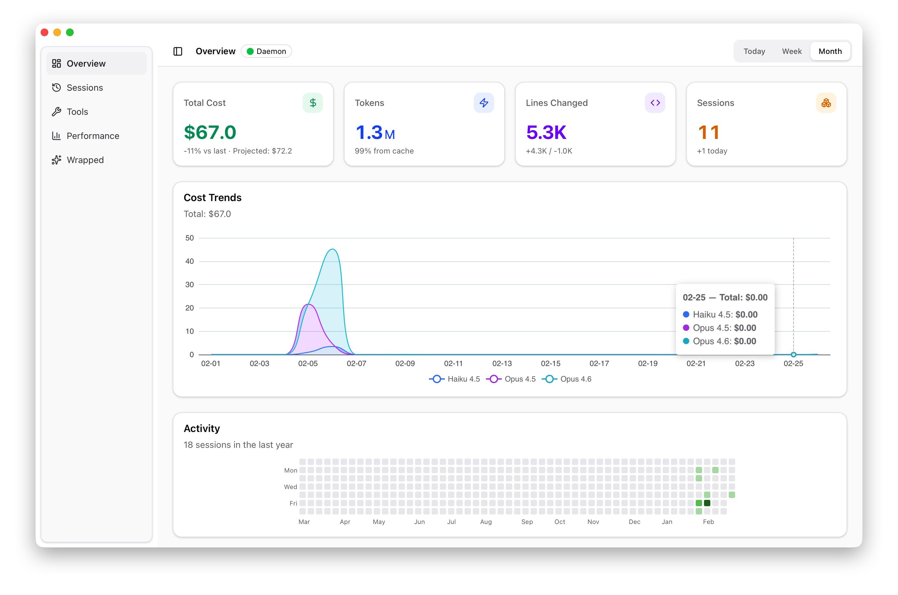
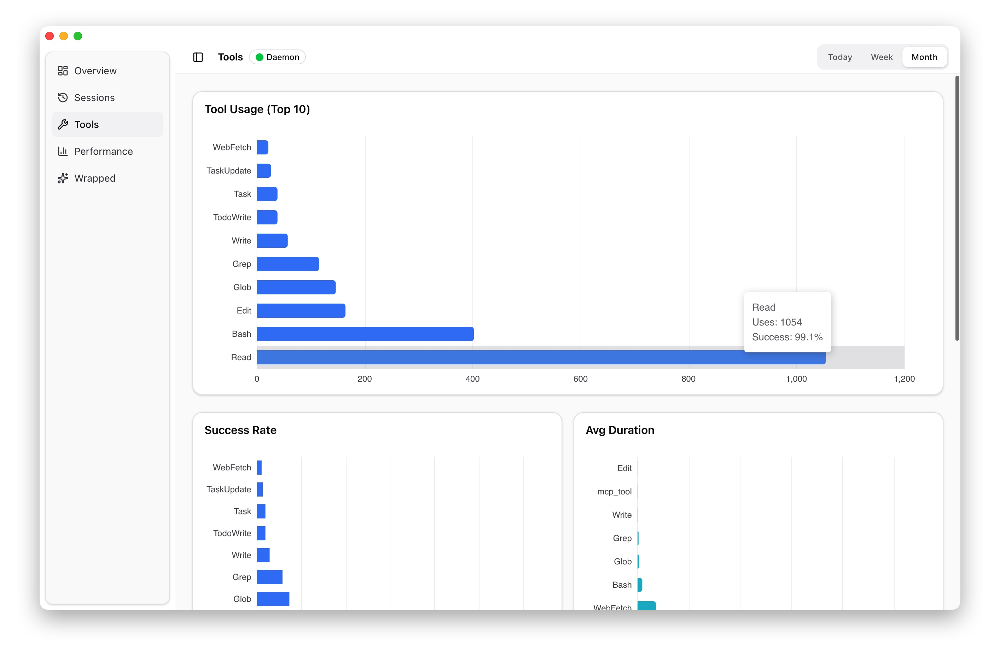
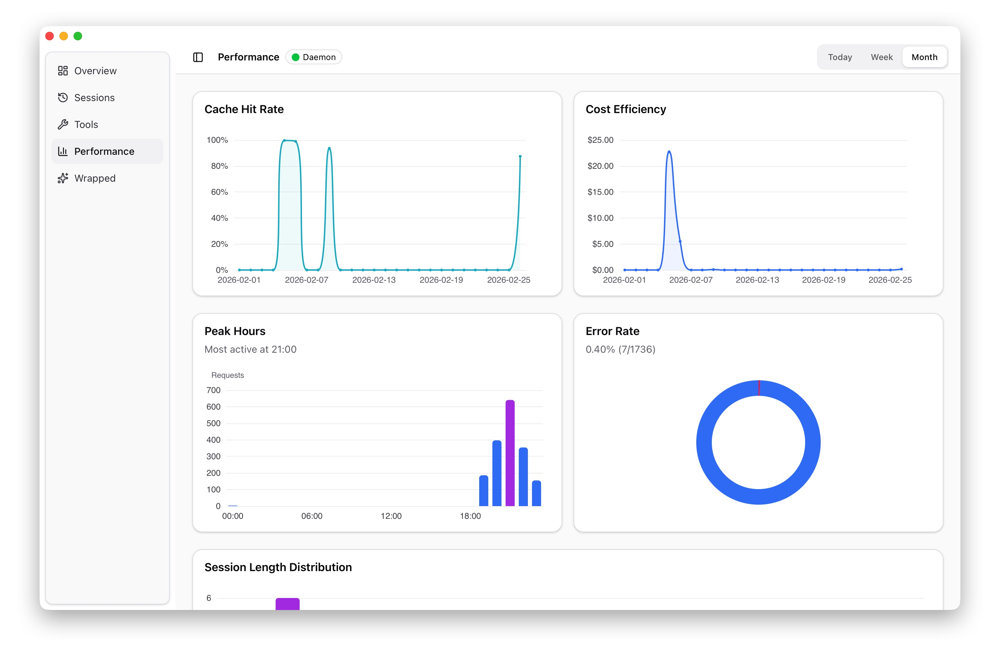
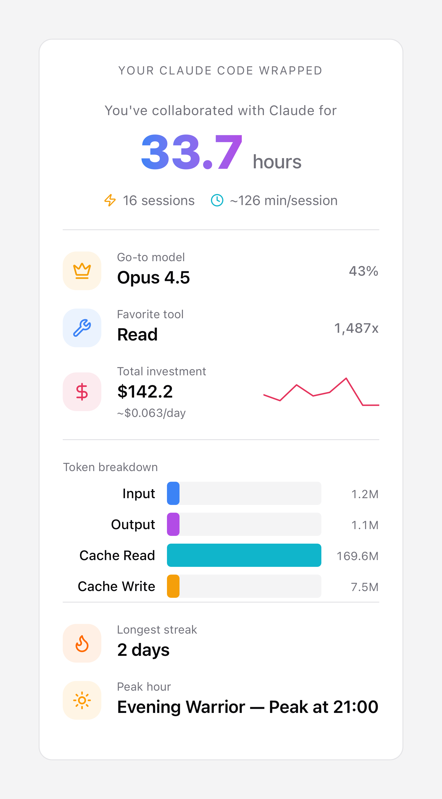

# Lumo（中文文档）

> 本文档是 `/README.md` 的中文说明版本，内容以当前已实现功能为准。

<p align="center">
  
</p>

<h1 align="center">Lumo</h1>

<p align="center">
  面向 Claude Code 的本地优先桌面使用分析面板。<br/>
  在你的机器上查看成本、Token、会话和编码时段数据。
</p>

<p align="center">
  <a href="../README.md">English</a>
</p>

---

## 为什么做 Lumo？

Claude Code 很强，但日常使用过程中很难回答这些问题：

- 今天/这周到底花了多少钱？
- 哪些模型、哪些会话消耗最多？
- 我真实投入了多少有效编码时间？
- 缓存命中率如何，是否用得高效？
- 是否连续工作过久，没有休息？

Lumo 用 Claude Code 已经产生的本地数据来回答这些问题。

- 不需要账号
- 不需要云端面板
- 数据不离开你的机器

---

## Lumo 是做什么的？

Lumo 由两个部分组成：

1. 本地 daemon（后台服务）
2. 桌面应用（Tauri + Next.js UI）

它会在本地收集 Claude Code 的遥测与 Hook 事件，写入 SQLite，并在桌面端展示为可读的图表和会话视图。

目标不是分析你的代码内容，而是帮助你理解使用模式、成本结构和工作节奏。

首次启动时，Lumo 还会尝试自动配置 Claude Code（本地 `~/.claude/settings.json`），把 OTEL 与 Hook 事件转发到 Lumo daemon。

---

## 截图

<p align="center">
  
</p>

你可以在桌面端快速看到成本趋势、Token、会话数量、代码改动和活跃热力图等关键指标。

---

## 主要功能（当前已实现）

### 1. Overview（总览）

- 总成本、Token、代码改动行数、会话数
- 按模型的成本趋势图
- 最近一年的活跃热力图
- 时间范围切换（Today / Week / Month）

<p align="center">
  
</p>

---

### 2. Sessions（会话列表与详情）

- 按项目分组与筛选 Claude Code 会话
- 会话列表显示项目、分支、消息数、更新时间
- 会话详情显示成本 / Token / 时长等元信息
- Session Highlights（工具调用、工具结果、失败数、触达文件数）
- Essential-only 模式（长会话更易读）
- 长消息列表虚拟渲染（性能更稳）
- 工具调用/结果块、Markdown 渲染、原始 payload 查看

<p align="center">
  
</p>

---

### 3. Tools（工具使用分析）

- 工具使用次数 Top 排名
- 各工具成功率
- 各工具平均耗时
- Code Edit 决策（接受/拒绝）及语言维度拆分
- 工具时间线趋势（按时间范围）

<p align="center">
  
</p>

---

### 4. Performance（性能与效率分析）

- 缓存命中率趋势
- 成本效率趋势
- 高峰时段分析
- 错误率与会话时长分布
- 按模型的 Token 使用分布

<p align="center">
  
</p>

---

### 5. Claude Code Wrapped（总结卡片）

- 周期切换（Today / This Week / This Month / All Time）
- 协作时长、会话数、平均会话时长
- 常用模型、最常用工具
- Token 构成与成本摘要
- 最长 streak、高峰时段
- 支持复制 / 保存分享卡片图片

<p align="center">
  
</p>

---

## 工作原理

```text
Claude Code ── OTLP logs/metrics + hooks ──▶ Lumo Daemon ──▶ SQLite ──▶ Desktop App
                                            (port 4318)     (~/.lumo)
```

### Lumo Daemon

- 接收 Claude Code 遥测：`/v1/logs`、`/v1/metrics`
- 接收 Claude Code Hook 通知：`/notify`
- 将数据写入本地 SQLite

### Desktop App

- 读取同一份本地数据库
- 展示总览、会话、工具分析、性能分析和 Wrapped

### 本地集成辅助（自动化）

应用启动后会尝试：

- 确保 daemon 已安装并运行
- 更新 `~/.claude/settings.json`（OTEL 导出与 hooks）
- 轮询 Hook 通知并发送系统通知（OS Notification）

---

## 隐私与数据

- 无需登录
- 无云端服务
- 无第三方分析
- 数据不离开本机

默认本地数据目录：

```bash
~/.lumo
```

你可以随时查看或删除。

---

## 安装方式

### 方式一：下载 Release（推荐）

1. 打开最新发布页：<https://github.com/zhnd/lumo/releases/latest>
2. 下载对应平台安装包
3. 安装并启动 `lumo`

在 macOS 上，Lumo 首次启动会自动管理 `~/.lumo/bin/lumo-daemon`，并注册 `launchd` 服务。

### 方式二：从源码运行

适合开发或二次修改。

---

## 开发启动（源码）

### 前置依赖

- Node.js >= 24.12
- pnpm >= 10.26
- Rust（stable）
- Tauri v2 对应平台依赖

### 启动命令

```bash
git clone https://github.com/zhnd/lumo.git
cd lumo
pnpm install
pnpm tauri:dev
```

应用启动后会尝试自动配置 Claude Code 的本地设置文件：

```bash
~/.claude/settings.json
```

你可以手动检查或调整该文件。

---

## macOS 安装常见问题

### 报错："已损坏，无法打开。你应该将它移到废纸篓"

这通常是 macOS Gatekeeper / 隔离属性（quarantine）导致的拦截，不一定代表应用真的损坏。

确认你是从官方 GitHub Releases 下载后，可按以下方法处理：

### 方法 1：系统设置中允许打开（推荐）

1. 先尝试打开 `lumo`（让它报错一次）
2. 打开 `系统设置` → `隐私与安全性`
3. 在底部找到被拦截的应用提示
4. 点击 `仍要打开`（Open Anyway）并确认

### 方法 2：移除隔离属性（终端）

如果应用在 `/Applications`：

```bash
xattr -dr com.apple.quarantine "/Applications/lumo.app"
```

如果在 `Downloads` 目录运行，请替换为实际路径。

> 不建议全局关闭 Gatekeeper。只对你信任的应用移除 quarantine。

---

## 技术栈

| 层 | 技术 |
|---|---|
| 桌面壳 | Tauri v2（Rust） |
| 遥测接收 | Axum + OpenTelemetry |
| Claude Code 集成 | `~/.claude/settings.json`（OTEL + hooks） |
| 数据库 | SQLite（SQLx） |
| 前端 | Next.js 16, React 19 |
| 状态与数据请求 | TanStack Query |
| 样式 | Tailwind CSS v4 + shadcn/ui |
| 图表 | ECharts + Recharts |
| 类型共享 | Typeshare（Rust → TypeScript） |

---

## 项目结构

```text
lumo/
├── crates/daemon/      # OTLP / Hook 接收服务
├── crates/shared/      # 数据库实体、仓储、迁移
├── src-tauri/          # Tauri 后端（IPC commands）
└── packages/ui/        # 桌面 UI
    ├── app/            # Next.js 路由
    ├── modules/        # Overview / Sessions / Tools / Performance / Wrapped
    └── components/     # 通用 UI 组件
```

---

## 许可证

MIT
